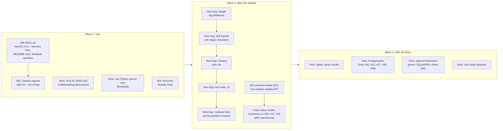
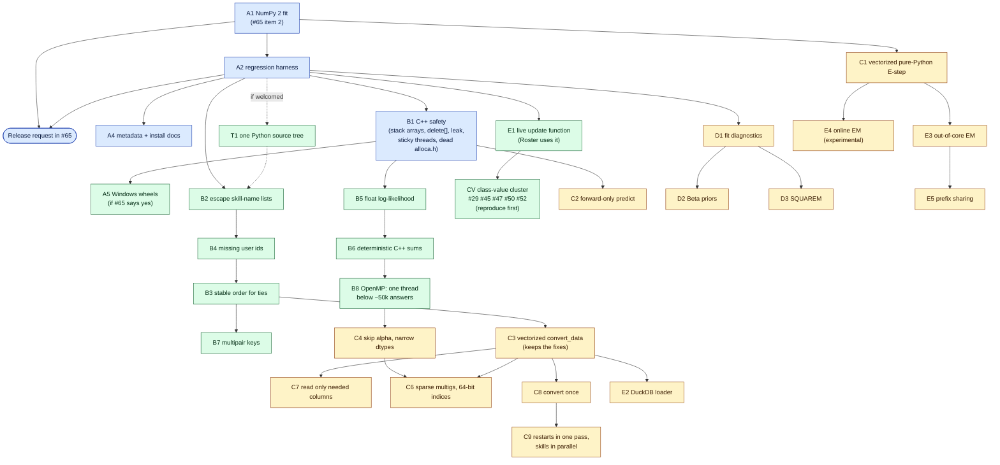
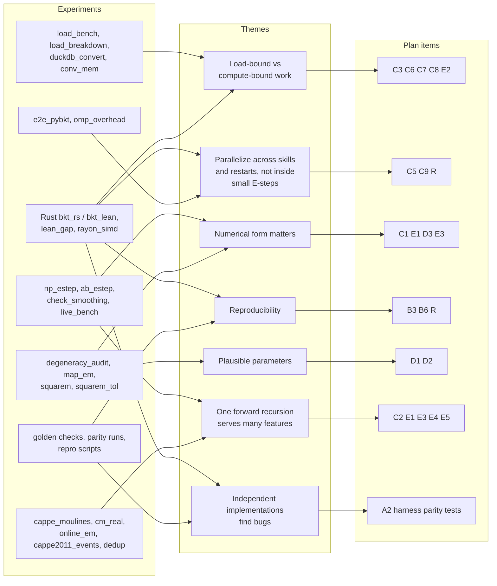
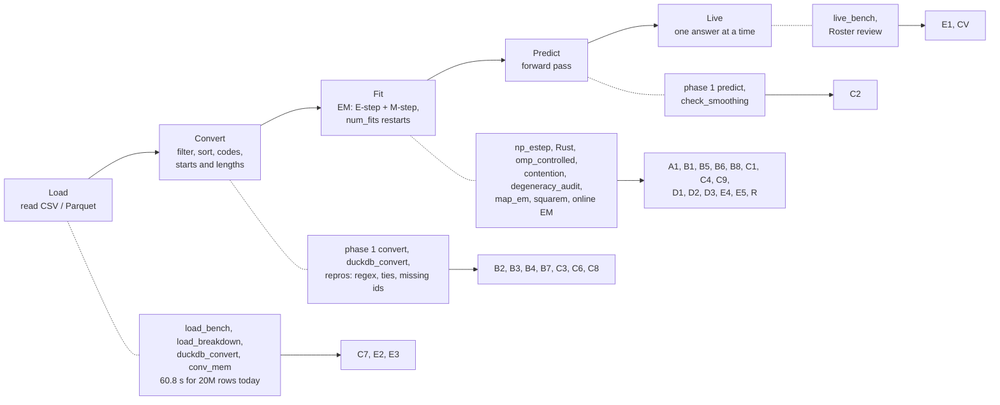

# Handoff: pyBKT correctness, speed and live-update work

> **Superseded on 2026-10-09.** This handoff is kept as a record of the research, but it is no
> longer the working plan. A narrower plan now sets the order, with measurable targets and a short queue.
> Corrections from a fact-check against upstream master `cc1682e`:
> - #65: zpardos asked for `PYBKT_REQUIRE_CPP` to stay off by default and be documented. Master already
>   does both (#67), so no README PR is needed.
> - Forks: 87 in total, 16 with their own commits (not 13). flixstn only silences the division warning;
>   gengyabc guards the division.
> - `noerr`: its fallback index 1 is out of bounds when only one template was fitted.
> - #51 merged on 2026-03-04, not in 2024.
> - The leak fixed by `34e3d21` is in `predict_onestep_states.cpp:82`; `E_step.cpp` leaks only one Python int.
> - Tied `order_id`, pure Python: parameters differ by 0.54 (not 0.63). Compiled: 0.14, as stated.
> - OpenMP on a busy machine: about 8 ms per call with some cores busy; 40 to 90 ms with every core busy.
> - Vectorized NumPy E-step: 29 to 54 times faster than the default pure-Python fit, depending on skill
>   size; matches C++ to about 1e-14.
> - Citations: Khajah et al. 2016 does not discuss gradient fitters. Beck & Chang 2007 names the
>   identifiability problem but does not show that priors fix it. The SQUAREM speedup and the
>   plausibility rates are this branch's own measurements, not results from the papers.
> - Since this was written: PR #74 (test suite) is open, the #70 and #72 markers are gone, and
>   `test/property-tests` and `fix/em-fit-numpy-2` are stacked on it.

Start here. This file is the plan another agent can pick up and run; it is current as of 2026-10-09.
- `PLANNING.md` is the decision log and the reasoning behind this plan (inventory, critiques, rounds of
  owner questions).
- `ISSUE_DRAFTS.md` holds the texts for upstream comments and issues, wave by wave.
- `README.md` (this directory) holds the research evidence and replication commands; `rust/REPORT.md` the
  Rust prototypes.

Owner: Christian Murphy (fork `ChristianMurphy/pyBKT`). Upstream: `CAHLR/pyBKT`, maintained by Zachary
Pardos (`zpardos`); Anirudhan Badrinath (`abadrinath947`) answered most issues from 2021 to 2024.

## 0. Rules for whoever picks this up

1. **Nothing goes upstream without the owner's go-ahead for that item**: no PR, issue or comment on
   CAHLR/pyBKT, and no PR on the fork. Prepare branches and drafts; the owner posts or approves.
2. **Fork commit messages never contain `#<number>`.** GitHub links them into the upstream issue's
   timeline (this happened to #65 and #72). Write "upstream issue 65" instead. PR descriptions and issue
   texts can use `#65`; that is where links belong.
3. **One change per PR**, independently mergeable, tested by the harness, small enough to review in five
   minutes. Every PR description has five lines: **what changes for users · class · evidence · research
   basis (citation, if any) · how to verify (one command)**. Classes: `[same]` (results bit-identical or
   within float tolerance), `[fix]` (a bug fix that changes results), `[opt-in]` (new, optional),
   `[infra]` (tests, build, docs).
4. **Result-changing fixes are the maintainer's call**, each through its own issue with a repro.
   **At most three upstream PRs open at once**; result-changing fixes one at a time. Open the next when one
   merges.
5. **No new required dependencies.** Optional extras only (`pyBKT[duckdb]`); Rust only as a separate
   optional package unless the maintainer asks otherwise.
6. **Rust code:** `#![forbid(unsafe_code)]` in our crates; avoid `unsafe`-heavy dependencies where
   practical; avoid marshalling copies (convert once, borrow buffers, let numpy allocate outputs).
7. **Branches:** research goes on `claude/pybkt-experiments-xqv9jv`. Each upstream PR gets its own branch
   off `cahlr/master`, named like the merged ones (`fix/...`, `feat/...`, `build/...`, `ci/...`,
   `test/...`). Ask the owner before pushing to an existing owner branch such as `test/regression-harness`.
8. **Before any push:** run the checks in section 8 and say plainly what passed and what didn't.

## 1. Where things stand

**Upstream master `cc1682e`** (2026-10-08) merged seven PRs from the owner: #64 (scikit-learn 1.8 import,
fixes #58), #66 (NumPy build requirement), #67 (`PYBKT_REQUIRE_CPP`), #68 (scikit-learn optional), #69
(cibuildwheel wheels: Linux x86_64/aarch64 manylinux and musllinux, macOS arm64/x86_64, CPython
3.10–3.14), #71 (fixes #70), #73 (fixes #72). **No release since 1.4.3**, which is a pure-Python wheel
that fails to import with scikit-learn ≥ 1.8 and fails to fit on NumPy 2.

**Fork branches**

| Branch | Content | State against upstream master |
| --- | --- | --- |
| `test/regression-harness` (`97a0eb1`) | test suite + Tests workflow, 12 files, 506 lines | merges cleanly; 3 strict-xfail markers now XPASS because #70/#72 are fixed |
| `claude/pybkt-performance-research-xqv9jv` | phase 1: `34e3d21` C++ crash/leak fixes (+ a forward-only `E_step.predict`), `fda90e7` forward-only predict, `37f57be` vectorized `convert_data`, `0a17b76` `bench.py` + `ROADMAP.md` | merges cleanly (including `E_step.cpp` with #71); same 3 markers |
| `claude/pybkt-experiments-xqv9jv` | this directory: research scripts, results, plan, drafts | not for upstream |

`upstream_sync_check.sh` reproduces the merge-and-test check; the log is `results/upstream_sync_check.log`.

**Upstream issues that bear on the plan** (all 55 issues and 18 PRs were read on 2026-10-09):

| Issue | What it says | Where it lands |
| --- | --- | --- |
| #65 (owner's, open) | wheels, NumPy 2 fit (item 2), optional scikit-learn; zpardos approved all three on 2026-10-09 and asked for README docs on `PYBKT_REQUIRE_CPP` | Train A continues here |
| #55, #57 (open) and #16, #19, #22 (closed, 2021) | one-step mastery updates; "current knowledge state" | E1 |
| #45 (open) | `crossvalidate` silently predicts 0.5 for unknown parameters; collaborator offered a warning | D1 |
| #21, #27, #36, #38 (closed) | inverted or varying mastery estimates; answered as random restarts or degenerate parameters | D1, D2 |
| #39 (closed by #41) | seeded C++ fits not reproducible; leftover differences called "floating-point error" | B6 (that leftover is the unordered parallel sum) |
| #32 (closed, 2022) | C++ build fails on Windows even with MSVC; "we do not officially support … Windows" | A5, asked in #65 first |
| #26 (closed, 2021) | slow outside Colab; answer: check whether the C++ build is installed | Train A, C1 |
| #29 (closed), #50, #52 (open), #47 (open), #45 (open) | class values breaking later: `Roster` with multigs models (#29, #50, #52), multigs `evaluate` IndexError on sequence-level splits (#47), multilearn `crossvalidate` vs `predict` (#45) | CV (class-value cluster), wave 2 after E1; reproduce first |
| #42 (closed), #11 (closed, 2021), #51 (merged, 2024) | pure Python parallelizes with a process pool; the pool broke on Windows twice | C1 removes the pool |
| #61 (closed with 1.4.3) | fit failed on Windows 10 ("invalid value encountered") | context for Windows users |
| #54 (open) | `random.randint(0, 1e8)`; fixed by merged #48 and #56 | comment that it can be closed |
| #37, #60 (closed) | "latest pyBKT not built", "new pip release" | precedent: release requests get answered |

**Upstream side branches and forks** (all branches of CAHLR/pyBKT and of the 13 active forks were fetched
on 2026-10-09 and compared with master):

| Where | What | Effect on the plan |
| --- | --- | --- |
| upstream branch `noerr` (Anirudhan Badrinath, 2022-12-28, unmerged) | unseen multilearn/multigs classes fall back instead of raising; the multigs matrix is sized from the *fitted* classes; `evaluate` clips invalid predictions with a warning | the starting point for CV (#45, likely #47); note its multigs fallback maps unseen classes to index 1, a real template |
| upstream branch `nopy` (2023-07-07, unmerged) | deletes the whole `source-py` tree and makes `setup.py` C++ only, the same day as the abandoned wheel workflow | the maintainers once went further than T1; the T1 proposal cites it and offers both directions |
| forks germanprogrammersberlin, gengyabc, flixstn (2026-03 to 2026-09) | each fixed the NumPy 2 fit (`EM_fit.py:43`) independently; gengyabc and flixstn also guard divisions in the E-step | A1 credits them in the PR text |
| fork huni1023 (2025-06) | "memory exhaustion in Windows": pool size cut to `cpu_count()/4` | more evidence against the process pool (C1) |
| fork justinas-kazanavicius (2025-05, 11 commits) | pyproject build backend, Apple Silicon flags, show build errors | earlier attempt at what #66/#67/#69 now do |
| forks taheralfayad, Wernerson | `random.randint(0, 1e8)` fixes | already fixed upstream (#48, #56) |
| fork Clyde3231/noGuess_pyBKT | a BKT variant without the guess parameter | research fork; no plan change |

pyBKT-examples has two issues, both closed, both about multiprocessing on Windows (2021, 2023): more
evidence for C1.

**Upstream git history that bears on the plan** (full history, 393 commits):

| Commit | Date | What it tells us |
| --- | --- | --- |
| `cda06d3` initial commit | 2017-01 | variable-length stack arrays and `alloca.h` in the E-step: the 200k-answer segfault and the MSVC blocker date from here |
| `8501508`…`71ed5ad` "almost mac compat", "mac compat added?", "mac fix" | 2020-07 | OpenMP on macOS took seven commits |
| `c3e98e4` "optimize data helper/cv"; `dbac5cb` "Model abstraction implemented"; `c1806c4` "regex full match" | 2021-02 | the two-step sort (tied `order_id`), the `groupby` lengths (missing user ids) and the unescaped skill regex |
| `dba0ddb` "completed boost removal" | 2021-04-14 | introduced `PyLong_FromLong(*total_loglike)`; before it, the log-likelihood was returned as a double. The integer log-likelihood is a regression, and the fix restores the original behaviour |
| `9ea4a2c`, `66c05d8` memory-leak fixes; `1721ab7` "fixed disable parallel" | 2021-04 | earlier leak work; `1721ab7` introduced the sticky `omp_set_num_threads(1)` |
| `691f24f` → `df2038b` "trying wheel building" → "removed gh actions" | 2023-07-07 | a cibuildwheel attempt for Ubuntu, Windows and macOS was cut to Ubuntu, then deleted the same day |
| `d7806c6` (#51) | 2024-08 | Windows users run the pure-Python path with multiprocessing |

## 2. Decisions so far (owner)

- Upstream PRs to CAHLR, landing on the fork first. Users: batch researchers, very large datasets, users
  without a compiler, live tutors. **Correctness first.**
- Result-changing fixes: ask the maintainer, one issue per bug with a repro.
- **Topic issues, no umbrella**, posted in **staged waves** (section 3).
- After install and release: **correctness, then live updates**, then speed and opt-in features.
- **Single Python source tree:** propose early; build it only if welcomed.
- **Windows wheels:** in scope; ask in #65 first because of #32.
- **`data_helper.py` order:** bug fixes first, then the vectorized `convert_data`, which must keep the fixed
  behaviour.
- **Rust:** open a discussion issue now, framed as "SIMD and multithreading help, but they are riskier to
  build in C and C++"; build nothing upstream until the maintainer replies.
- Docs: five-line PR summaries, README sections for user-visible changes, notebooks or docs pages for
  opt-in features.
- Evidence for upstream readers goes on a clean, neutrally named fork branch (default name
  `evidence/bkt-research`; confirm with the owner before creating it).
- Round 7: the single-tree proposal **cites `nopy` and offers both directions** (one tree with a NumPy
  fallback, or C++ only once Windows wheels exist); the class-value work **builds on `noerr`** (credit its
  author, add repros and tests, fix its multigs fallback); the NumPy 2 PR **credits the three forks** that
  fixed it first; **at most three upstream PRs open at once**.
- Round 6: the **class-value cluster** (#29, #45, #47, #50, #52) goes in wave 2 after E1, reproduced first;
  the **OpenMP default for small calls** (B8) moves into wave 2 with the C++ fixes; the pure-Python
  **process pool** is fixed only by the vectorized E-step (C1), no separate pool PR; the Rust discussion
  proposes **`bkt_lean` plus rayon** (work stealing, measured not to stall under contention).

## 3. Discussion plan: topic issues in three waves

Existing threads are reused where they fit; new issues are opened only for a decision the maintainer can
make on its own. Texts are in `ISSUE_DRAFTS.md`.



Why topic issues and waves: each risky proposal (Rust, single tree, each result change) can be declined
without stalling the rest; the maintainer sees a few threads at a time; and earlier merges build the
trust that later, larger proposals need. Bug issues go one at a time, each with its PR ready.

## 4. Work order



Blue is wave 1, green wave 2, amber wave 3. Dashed edges apply only if the maintainer welcomes the single
source tree. Several PRs edit the same files, so merge them in this order:

| File | PRs, in merge order |
| --- | --- |
| `fit/E_step.cpp` | B1 → B5 → B6 → B8 → C4 → C6 (E5 later) |
| `util/data_helper.py` (two copies until T1) | B2 → B4 → B3 → B7 → C3 → C6 / C7 |
| `models/Model.py` (two copies) | E1, D1 (additions) → CV → B7 → C8 → C9 |
| `models/Roster.py` (two copies) | E1 → CV |
| `fit/EM_fit.py` (two copies that differ) | A1 → B5 → C1 → C4 → C9 → D3 |
| `tests/reference/*.json` | one result-changing PR at a time; its JSON diff is the evidence |

## 5. Task cards

Each card says what to build and how to know it's done. Line numbers are on upstream master `cc1682e`.
"Verify" commands assume the environments from section 8.

### Wave 1

**A1 · Pure-Python fit works on NumPy 2** · `[fix]` · branch `fix/em-fit-numpy-2` · issue #65 item 2
- Change: `source-py/pyBKT/fit/EM_fit.py:43` assigns a (1, 1) array into a scalar slot. Store a scalar,
  for example `float(np.squeeze(result['total_loglike']))`. Make the same change at
  `source-cpp/pyBKT/fit/EM_fit.py:25` so both copies stay alike (there the value is a Python int, see B5).
- Verify: pure Python on NumPy 2 fits (`PYTHONPATH=source-py python -c "…Model(seed=0).fit(data=df)…"`);
  the harness's 8 `FAILS_ON_NUMPY2` cases pass.
- Credit: the PR text says the same fix appears in forks by germanprogrammersberlin
  (`kompat-numpy2-sklearn16`), gengyabc and flixstn, with links. No co-author lines.
- Risk: none known; results unchanged where the code ran before.

**A2 · Regression harness** · `[infra]` · from `test/regression-harness` (`97a0eb1`), rebased on A1
- Delete three obsolete markers: `CPP_TEMPLATE_BUG` in `tests/test_backend_parity.py`, the #70 marker in
  `tests/test_parameter_recovery.py`, the #72 marker in `tests/test_one_attempt_students.py`; and
  `FAILS_ON_NUMPY2` in `tests/helpers.py` once A1 is in.
- Verify: all three configurations pass with no xfail/xpass (section 8).
- Follow-up (later, optional): run the harness inside cibuildwheel (`CIBW_TEST_COMMAND`) so every wheel
  platform is tested. Its tolerances (`rtol` 1e-7 outputs, 1e-9 EM parity) are untested off Linux.

**A4 · Metadata and install docs** · `[infra]` · branch `docs/install-and-metadata`
- `setup.py`: `python_requires=">=3.10"` (matches the wheel matrix), classifiers 3.10–3.14 (now 3.5–3.8).
- README: wheels are compiled; how to check (`pyBKT.version`, `import pyBKT.fit.E_step`);
  `PYBKT_REQUIRE_CPP=1` to fail loudly when building from source (default 0, as zpardos asked in #65);
  update "Installing Dependencies for Fast C++ Inferencing (Optional - for OS X and Linux)".
- Users on Python < 3.10 keep getting 1.4.3 from pip; say so in the PR.

**Release request** · comment on #65 once A1 and A2 are merged (text in `ISSUE_DRAFTS.md`). Key points:
tag without a `v` (like `1.4.3`); release notes must say that #70 and #72 change fitted values.

**B1 · C++ safety** · `[same]` · branch `fix/cpp-e-step-heap-scratch` · from `34e3d21`
- Port `34e3d21`: per-student scratch arrays move from the stack to `std::vector` (a student with 200,000
  answers segfaults today; OpenMP worker threads have smaller stacks); `delete` → `delete[]`; the leak;
  `parallel=False` no longer calls the process-wide `omp_set_num_threads(1)`.
- Also delete the dead `#include <alloca.h>` in `predict_onestep_states.cpp:5` and
  `synthetic_data_helper.cpp:13` (nothing calls `alloca`). That finishes the MSVC prerequisites in code.
- Move the forward-only `E_step.predict` entry point that `34e3d21` adds into C2 instead, so B1 is purely
  a safety change.
- Verify: `tests/test_long_sequences.py` (from `34e3d21`) passes; harness passes; outputs bit-identical to
  master on the harness fixtures; `g++ -std=c++17 -fsyntax-only -pedantic-errors -Wvla -Wno-write-strings`
  reports no errors (it reports five variable-length arrays on master).

**Issues to post in wave 1** (owner posts): #65 follow-up, Rust discussion, single-tree proposal, #54
comment. See `ISSUE_DRAFTS.md`.

### Wave 2

**A5 · Windows wheels** · `[infra]` · after B1 and a yes in #65
- `setup.py`: an MSVC branch (`/openmp`, `/O2`; no `-fPIC`, `-fopenmp`, `-w`). Check `long` uses
  (32-bit on Windows). Add `windows-latest` to `release.yml`; the wheel test imports `E_step`.
- MSVC supports OpenMP 2.0 only: `parallel for` needs a signed loop index (`predict_onestep_states.cpp:97`
  uses `int`, fine).
- Verify: the PR's own wheel build (`release.yml` runs on pull requests). Expect several CI rounds; nobody
  has a Windows compiler in this environment.

**T1 · One Python source tree** · `[infra]` · only if the single-tree proposal is welcomed
- Today `source-cpp/pyBKT` and `source-py/pyBKT` each hold the same 24 Python files: 17 identical, 7
  different (`EM_fit.py` by 230 lines, `predict_onestep.py` by 67, five others by 2–4). Every Python fix
  is made twice, and #72 was a drift between the copies.
- Target: one `pyBKT/` tree; the compiled `E_step`/`predict_onestep_states` modules optional at import,
  with the NumPy versions as the fallback; `pyBKT.version` still reports which is active; `setup.py`
  builds the extension when it can.
- Do it before B2–B4 if accepted; otherwise B2–B4 edit both copies.
- History: the upstream branch `nopy` (2023-07-07, unmerged) deleted `source-py` and made the package C++
  only. The proposal cites it and offers both directions: (a) one tree with the NumPy E-step as fallback;
  (b) C++ only, once Windows wheels exist. (b) leaves platforms without wheels and failed builds with
  nothing, so (a) is the recommendation, but it's the maintainer's call.

**Bug PRs, one at a time, each with its issue** (repros in this directory; each changes results):

| PR | Bug | Repro | Fix | Results that change |
| --- | --- | --- | --- | --- |
| B5 | Compiled log-likelihood is an integer (`E_step.cpp:341`, since `dba0ddb`, 2021-04) | `integer_loglike.py`: whole-number trace ending −1508, −1507, −1507; EM stops after 15 iterations with `tol=0.005` | `PyFloat_FromDouble`; restores pre-2021 behaviour | compiled fits run longer (24 → 47 iterations on ASSISTments); `num_fits` choice |
| B2 | Skill-name lists joined into an unescaped regex (`data_helper.py:25`); after `fit`, `model.skills` is that list | `regex_skill_names.py`: default `'.*'` fits the skill but predicts all its rows at 0.5; a list skips it in `fit` | `re.escape` each name when `skills` is a list; a string stays a regex (documented API) | predictions and fits for skills whose names contain `+ ( ) * …` (2,339 ASSISTments rows) |
| B4 | Missing `user_id`: `groupby` drops them from `lengths` (`data_helper.py:164`) but the rows stay | `nan_user_ids.py`: fit ignores them; predict returns 1.12 and 0.0 (pure Python) or 0.0 (compiled) | drop with a warning, or raise (maintainer's choice) | only data with missing ids |
| B3 | Ties in `order_id` ordered by quicksort (`data_helper.py:99`), then a stable sort by user (`:117`) | `tied_order_ids.py`: same rows in two orders, parameters differ by 0.14 (compiled) and 0.63 (pure Python) | one stable sort by (user, order_id) that keeps file order for ties | data with ties (29.6% of ASSISTments rows) |
| B7 | multipair keys are array reprs (`data_helper.py:192`) | needs pandas 2 and 3: fit under 2, predict under 3, every pair "not fitted" | keys from values; read old keys when loading | multipair models across pandas versions |

**B6 · Deterministic C++ sums** · `[same]` up to the last bits · after B5 · refers to #39
- Threads add their counts in a `critical` section in arrival order (`E_step.cpp:306`). Store per-block
  partial counts and add them in block order after the parallel region.
- Verify: identical hashes over 20 runs and 1–16 threads (method: `rust/py/determinism.py`; C++ gave 1–3
  distinct results in 20 runs on ASSISTments, 6–7 on synthetic data).

**B8 · OpenMP default for small calls** · `[same]` up to the last bits · after B6 · no new issue; the PR
carries the measurements
- With every core busy, each OpenMP E-step call waits about 8 ms whatever its size: 1,800 answers take
  8.0 ms against 93 µs serial; 22,900 answers 8.0 ms against 1.2 ms (`omp_controlled.sh`,
  `results/omp_controlled.csv`). Idle, OpenMP helps 1.7–2.9x from about 1,800 answers. Real data has many
  small skills, so default users on shared machines (other jobs, notebooks, parallel workers) pay this.
- `schedule(dynamic, 16)` was tried and doesn't help (`results/omp_dynamic.csv`): the stall is the
  fork-join barrier, where every thread must arrive, not the work split.
- Change: `num_threads(1)` below a threshold (start at 50,000 answers; calibrate with
  `omp_controlled.sh` idle and loaded), keep OpenMP above it. Parallelism across skills is C9's job.
- Same for `predict_onestep_states.cpp`'s `parallel for`.
- Verify: harness passes; `omp_controlled.sh` before and after, idle and with 4 busy processes; the README
  documents `OMP_NUM_THREADS` and `parallel=False` for busy machines.

**E1 · Live mastery updates** · `[opt-in]` · after the #55 comment
- `Roster.update` (2021) already updates one student per answer, but it swaps the shared model's prior to
  the student's state, runs the full predict path on the new answers, then restores the prior
  (`Roster.py:577–585`). #55 and #57 ask for a plain one-step function.
- Build a pure function (normalized two-state update: posterior from the answer, then the learn/forget
  transition), plus a vectorized form for many students; make `Roster` use it so it stops mutating the
  model. Keep `Roster`'s API.
- Evidence: `live_bench.py` (2.4 µs per answer in plain Python; matches `predict` to 1.6e-9 on 294k
  answers; the textbook `1 − P(correct)` form loses precision near 0 and 1).
- Verify: equals `predict`'s state predictions on the harness data; equals today's `Roster` outputs.

**CV · Class-value cluster** · investigate first · after E1 · issues #29, #45, #47, #50, #52
- Five reports of multigs/multilearn class values breaking after `fit`: `Roster` built from a multigs
  model fails with a broadcast `ValueError` (#29, #50; #52 after loading a model with joblib, the
  traceback points at `Roster.process_data` passing `True` instead of class names); `evaluate` raises
  `IndexError` on sequence-level splits with multigs (#47); `crossvalidate` predicts 0.5 for unseen
  multilearn classes where `predict` raises (#45).
- Start from the maintainers' own unmerged branch `noerr` (2022-12-28): unseen classes fall back to a
  default instead of raising (#45), the multigs matrix is sized from the fitted classes, and `evaluate`
  clips invalid predictions with a warning. Rebase it, credit Anirudhan Badrinath, and fix its multigs
  fallback (`gs_ref.get(x, 1)` maps an unseen template to index 1, which is a real template).
- Likely cause of #47 (a hypothesis until reproduced): `data_temp` gets one row per template present in the
  evaluated data, but the indices come from the fitted templates, so a test split missing a template
  indexes past the end. `noerr` sizes it from `gs_ref`.
- Step 1: reproduce each symptom on public data (ASSISTments or the CT sample), one script per symptom.
  Step 2: group by cause; one PR and one comment on the matching issue per cause. The `Roster` cause
  (#29, #50, #52) is separate from `noerr`'s changes.

### Wave 3 (cards are shorter; refresh numbers before posting)

| PR | What | Source | Key evidence | Notes |
| --- | --- | --- | --- | --- |
| C2 | forward-only predict | `fda90e7` + `E_step.predict` from `34e3d21` | 1M rows 60 → 14 ms; multigs × 50 templates 3.27 → 0.12 s, half the peak memory | `[same]` |
| C3 | vectorized `convert_data` | `37f57be`, re-applied after B2–B4/B3 | 5M rows/100 skills 31.6 → 2.0 s; multipair 100k 17.2 → 0.06 s | must keep the fixed behaviour; identical output across 46 input shapes |
| C1 | vectorized pure-Python E-step | `np_estep.py` (posterior-form backward pass) | 20–24x faster than pyBKT's default (a process pool per E-step), 32–40x than serial; matches C++ to 3.4e-15; removes the process pool that broke on Windows (#11, #51) | decided: this is the only fix for the pool (about 25 ms per iteration; small skills 9x slower than serial; it broke on Windows in #11, #51, pyBKT-examples #1 and #2, and fork huni1023 shrank it for memory); scaled-β form overflows on long sequences, use the posterior form |
| C4 | skip `alpha` during EM; int8 answers, int32 resources; alpha's labelled shape | ROADMAP | 16 B/answer per iteration not written | |
| C7 | read only needed columns | `load_bench.py` | 20M rows 60.8 s / 5.0 GB → 33.0 s / 2.6 GB | keep every column the model type needs |
| C8 | convert once (prepared data); stop sorting the caller's DataFrame in place | `lean_gap.py` | per-call copies cost ~40% of a fast E-step | `fit` reorders the caller's DataFrame today |
| C9 | all `num_fits` restarts in one pass; skills in parallel (the rest of the old C5) | ROADMAP, `results/omp_controlled.csv` | `num_fits=5` takes 4.3x one fit; one parallel region across skills amortizes the 8 ms barrier stall | keep random draws in today's order |
| C6 | sparse multigs, 64-bit indices | ROADMAP | 1.47 GB → ~2 MB (all ASSISTments skills merged) | |
| D1 | fit diagnostics (warnings) | `degeneracy_audit.py` | 9.1% implausible, 11.8% at 0/1, 74 of 110 skills' restarts disagree | addresses #45 and the #21/#27/#36/#38 pattern; also warn when a fit sits on a plausibility bound (`optimizers.py bounded`: bounded fits stop at guess = 0.500 when the data favour a degenerate solution) |
| D2 | Beta priors, `priors=` | `map_em.py`; Beck & Chang 2007 | stuck at 0/1: 15.3% → 0%; held-out ll slightly better | defaults need choosing; global optimizers find higher-likelihood but implausible optima on 4 of 8 skills (`optimizers.py`), so the objective needs priors, not a stronger optimizer |
| D3 | SQUAREM, `accelerate=` | `squarem.py`; Varadhan & Roland 2008 | 1.4–1.7x fewer E-steps; never worse in 48 runs | needs step cap and monotone guard; re-checked against L-BFGS, Nelder–Mead and differential evolution: SQUAREM needs the fewest passes (median 12 vs EM 17.5, L-BFGS 20) |
| E2 | DuckDB loader extra | `duckdb_convert.py` | 20M rows read + convert 14.3 s vs 60.8 s | optional dependency |
| E3 | exact out-of-core EM | `check_smoothing.py`; Cappé 2011 | equals forward-backward to 2.5e-16 | |
| E4 | online EM (experimental) + `partial_fit` docs | `online_em.py`, `cappe_moulines.py`; Cappé & Moulines 2009 | one pass within 0.0016 of truth (batch 0.0013) | event-level variant not planned |
| E5 | prefix sharing | `dedup.py` | 2.75x less work (ASSISTments), ~25x (short sessions) | counted only, not built |

## 6. What the experiments add up to

The research covered loading, conversion, the E-step in three languages, EM itself, prediction and live
updates. Read together, the experiments point to a few themes; each theme shapes several plan items.



| Theme | What the experiments showed | Consequence for the plan |
| --- | --- | --- |
| Load-bound vs compute-bound work | Reading and converting 20M rows takes 60.8 s; one C++ E-step pass over them takes about 0.3–1.1 s (14–53 ns per answer). A default fit makes many passes (iterations × 5 restarts), so fits are compute-bound while `predict` and other one-pass work is load-bound. The dense multigs matrix (1.47 GB) and per-call copies (~40% of a fast Rust E-step) cost in both | one-pass work: cheaper reading and convert-once (C7, C8, E2); fits: fewer passes (C9, D3) and a faster kernel (C1, R); both: compact layouts (C4, C6) |
| Parallelize at the right level | Controlled (2026-10-09): idle, OpenMP helps 1.7–2.9x; with every core busy, each OpenMP call waits ~8 ms whatever its size, and dynamic scheduling doesn't help. Rust with rayon's work stealing doesn't stall (56 µs vs 8 ms at 1,800 answers); Rust threads spawned per call do (4 ms). Pure Python's per-iteration process pool costs ~25 ms per iteration. Real data has many small skills | one thread below a size threshold (B8), parallel across skills and restarts (C9), no process pool (C1), rayon in the Rust design (R). Mixed performance/efficiency cores are still unmeasured |
| Numerical form matters | the scaled-β backward pass overflowed (NaN) on a 3,585-answer student; the textbook live update loses precision; SQUAREM without its step cap jumped to 0/1 boundaries | posterior-form backward pass (C1, E3), normalized live update (E1), SQUAREM safeguards (D3) |
| Reproducibility | C++ parallel sums vary run to run (#39's leftover); tied `order_id` order depends on input order; Rust's fixed-order reduction is bit-identical across threads and ISAs | B6, B3; Rust design (R) |
| Plausible parameters | 9.1% of kept fits implausible, 11.8% at 0/1; restarts disagree in 74 of 110 skills; four closed issues show users confused by exactly this | warnings first (D1), priors as an option (D2) |
| One forward recursion serves many features | forward-only smoothing (Cappé 2011) gives exact E-step counts without a backward pass | the same φ/ρ recursion underlies predict (C2), live updates (E1), out-of-core EM (E3), online EM (E4) and prefix sharing (E5) |
| Independent implementations find bugs | the harness's C++ vs pure-Python parity tests found #70 and #72; the vectorized NumPy E-step confirmed #72's effect (parameters up to 0.085 apart); Rust parity found the mislabelled alpha shape; live updates vs `predict` found the regex and tie bugs | keep a reference implementation in the harness as an oracle (A2), and add parity tests whenever a backend is added |

### The pipeline, end to end

Where each experiment measured, and which plan items act there:



### Experiment ledger

Every experiment, what it answered, and where it went. "Open" marks threads nobody has finished.

| Experiment | Question | Answer | Goes to |
| --- | --- | --- | --- |
| `check_smoothing.py` | Can the E-step run forward-only? | Yes: Cappé 2011 Prop. 1, equals forward-backward to 2.5e-16 | E3, E4, E5 basis |
| `online_em.py`, `cappe_moulines.py`, `cm_real.py` | Does C&M 2009 online EM work for BKT? | Student-level, one pass within 0.0016 of truth (batch 0.0013); held-out median gap 0.0012 | E4 (experimental) |
| `compare_em.py`, `compare_online.py`, `synth_discount.py` | Do simpler online variants work? | Filtering-only is biased; ad-hoc variants lag; discounting needs per-contribution decay | E4 design notes (what not to do) |
| `cappe2011_events.py` | Event-level online EM? | Stable only at α = 0.8 in our multi-student adaptation | not planned |
| `degeneracy_audit.py` | How plausible are pyBKT's fits? | 9.1% implausible, 11.8% at 0/1, restarts disagree in 74 of 110 skills | D1 |
| `map_em.py` | Do Beck & Chang priors help? | Stuck-at-0/1 fits 15.3% → 0%, held-out ll slightly better | D2; **open:** default prior strengths |
| `squarem.py`, `squarem_tol.py` | Does SQUAREM speed EM safely? | 1.4–1.7x fewer E-steps with step cap and monotone guard | D3 |
| `np_estep.py`, `ab_estep.py`, `py_vs_vec_fit.py`, `vec_vs_cpp_fit.py` | Can pure Python be fast? | 20–24x vs default, 32–40x vs serial; exact vs C++; stable form costs 11–15% | C1 |
| `dedup.py` | How much do shared answer prefixes save? | 2.75x (ASSISTments) to ~25x (short sessions), counted | E5; **open:** not built |
| `load_bench.py`, `load_breakdown.py`, `conv_mem.py` | Where does loading time go? | pandas `usecols` halves time and memory; DuckDB fastest; pandas 3 memory is a pyarrow effect | C7, E2, docs |
| `duckdb_convert.py` | Can `convert_data` run in SQL? | Yes, identical for all students without ties | E2, B3 (tie-break) |
| compact `.npy` store (`load_bench.py`) | Can conversion be cached? | Reload 20M rows in 0.03 s | E3 / large-data issue |
| `e2e_pybkt.py`, `omp_overhead.py`, `omp_controlled.*`, `rust/contention*` | What does OpenMP cost? | ~8 ms per call when cores are busy; dynamic scheduling doesn't help; rayon doesn't stall | B8, C9, R |
| `live_bench.py` | Exact O(1) live updates? | 2.4 µs per answer, matches `predict` to 1.6e-9; found the regex and tie bugs | E1, B2, B3 |
| Rust `bkt_rs`, `bkt_lean`, `rayon_simd.py`, `lean_gap.py`, `lean_fit_check.py`, audits | Is a safe Rust E-step worth it? | Bit-identical serial, 2.1–2.5x; 10–39x with SIMD and threads; per-call copy ~40%; dependency `unsafe` counted | R; **open:** a global length-sorted chunk plan for SIMD lanes |
| GPU assessment (wgpu, vulkano, cuda-rust) | Would a GPU help? | Not at typical sizes | not planned |
| `optimizers.py` (round 8) | Would another optimizer, or the Rust library Basin, fit faster or better? | SQUAREM fastest (median 12 passes vs EM 17.5, L-BFGS 20, Nelder–Mead 209, differential evolution 1,449); local methods agree from the same start; global search finds higher-likelihood, implausible optima (4 of 8 skills); bounds just move the fit to the bound. Basin: sound, no EM support, 731 `unsafe` lines in default dependencies | D3, D1, D2; Basin and global optimizers not planned |
| Phase 1 branch, `bench.py`, golden checks | Crash, leak, predict, convert | Fixed and faster, bit-identical | B1, C2, C3 |
| Repros (`integer_loglike.py`, `regex_skill_names.py`, `nan_user_ids.py`, `tied_order_ids.py`) | Do the bugs reproduce on small data? | Yes, in seconds | B5, B2, B4, B3 |
| `upstream_sync_check.sh` | Do the fork branches still fit upstream? | Clean merges; only obsolete markers fail | A2 |
| Upstream side branches and 13 active forks (round 7) | Has anyone already done parts of this? | `noerr` (class values), `nopy` (drop pure Python), three NumPy 2 fixes, a Windows pool-size fix, an earlier build-backend attempt | CV, T1, A1, C1 |
| Literature (`online_bkt_literature.md`, `deep_research_summary.md`, Khajah JEDM) | What does research support? | Online EM of global BKT parameters is new; KT² is per-student personalisation; gradient fitters suit extensions | E4 docs, not planned |

**Other open threads:** K7's repro needs pandas 2 and 3 side by side; Hawkins et al. 2014 is unread;
macOS (LLVM libomp) and Windows OpenMP behaviour under contention are untested; mixed
performance/efficiency cores are unmeasured; compiled and pure-Python fits differ on tie-heavy data
(section 9).

What was tried and set aside, with reasons, is in `PLANNING.md` section 7 ("Not planned"): event-level
online EM (stable only at α = 0.8), a GPU backend (no benefit at typical sizes), a gradient-based fitter,
a parallel scan over time, swapping the binding layer, Numba/Cython, Polars as a requirement.

## 7. Rust: why SIMD and multithreading belong there

**The framing for the discussion issue:** SIMD and multithreading would help pyBKT a lot, but they are
riskier to build in C and C++ than in Rust. The C++ backend gets the safety and determinism fixes it needs
(B1, B5, B6) and no new SIMD or threading code.

**What SIMD and threads gave** (measured on a 4-vCPU VM, `rust/REPORT.md`):

| | ASSISTments (as_all) | synthetic 5M answers |
| --- | --- | --- |
| C++ serial / 4 OpenMP threads, ns per answer | 47.9 / 28.7 | 53.2 / 14.0 |
| Rust exact serial (bit-identical to C++) | 22.5 (2.1x) | 21.5 (2.5x) |
| Rust SIMD across students, 4 threads | 2.3 (12.7x vs C++ parallel) | 1.45 (9.7x vs C++ parallel; 37x vs serial) |
| 20-iteration fit in Rust, 4 threads, SIMD | 0.022 s (20x vs C++ serial fit) | 0.15 s (39x) |

**Why it is riskier in C/C++, from this codebase's own history:**

| Problem | Where | Status |
| --- | --- | --- |
| Per-student stack arrays: segfault at 200k answers, and MSVC can't compile them | since the 2017 initial commit | B1 fixes |
| `delete` on `new[]` memory; a leak; earlier leak fixes in 2021 | `E_step.cpp:34`, `9ea4a2c`, `66c05d8` | B1 fixes |
| `parallel=False` switches OpenMP off for the whole process | `1721ab7` (2021) | B1 fixes |
| Unordered parallel sums: seeded fits not reproducible | #39; 1–3 distinct results in 20 runs | B6 fixes |
| OpenMP calls stall ~8 ms each when other processes hold the cores; dynamic scheduling doesn't help | measured 2026-10-09 (`omp_controlled.sh`) | B8 works around it with a size threshold |
| Loop variables not reset: every template used the first one's parameters | #70 (found by the harness's C++ vs Python parity test) | fixed by #71 |
| OpenMP portability: seven commits for macOS (2020); Windows never built (#32); a 2023 wheel attempt for Windows and macOS was removed the same day | history | A5 asks first |

Adding SIMD in C++ means intrinsics per instruction set or compiler-specific multiversioning, and wheels
built for the manylinux baseline (SSE2) unless dispatch is added by hand. Adding threads means more shared
mutable state that the compiler does not check.

**What Rust gives instead** (from the prototypes):
- `#![forbid(unsafe_code)]` in our crates: the compiler rejects data races and out-of-bounds writes in our
  code.
- Safe SIMD with runtime dispatch (`fearless_simd`): the same binary uses SSE2, AVX2 or AVX-512, and
  results are bit-identical across all of them.
- A fixed-order reduction: bit-identical results for 1–16 threads and across runs.
- Work stealing (rayon) that keeps working when other processes take the cores. Measured with every core
  busy (`rust/results/contention_small.csv`):

  | 4 busy processes | 1,800 answers | 22,900 answers |
  | --- | --- | --- |
  | C++ OpenMP | 7,972 µs | 8.0 ms |
  | C++ serial | 151 µs | 1.34 ms |
  | Rust, rayon (forced onto 4 threads) | **56 µs** | **557 µs** |
  | Rust, scoped threads spawned per call | 3,996 µs | 4.0 ms |

  A preempted rayon worker delays only the chunk it holds; the calling thread takes the rest. OpenMP's
  fork-join waits for every thread, and dynamic scheduling doesn't change that. On large calls every
  threaded variant slows in proportion to the CPU it loses. Mixed performance/efficiency cores are not
  measured, but they are the same situation: threads that run at different speeds.

**Design to propose: `bkt_lean` plus rayon.** `bkt_lean` keeps the small dependency set (pyo3 only),
zero-copy input buffers and numpy-allocated outputs; rayon replaces its per-call scoped threads, which
stalled under contention. That adds rayon, rayon-core and crossbeam (about 150 + 245 `unsafe` lines by the
audit's count) to `bkt_lean`'s 2,457. This combination hasn't been built yet: `bkt_rs` shows rayon works
and is deterministic, `bkt_lean` shows the lean bindings work; building `bkt_lean` + rayon is the first R
task if the maintainer is interested.

**Costs to state plainly:**
- Dependencies still contain `unsafe`: 2,457 lines in `bkt_lean`'s linked crates (pyo3, pyo3-ffi, libc,
  which any Rust extension needs); 2,560 with `fearless_simd`; 3,704 for the numpy + rayon variant. No
  RustSec advisory affects the resolved versions (checked 2026-10-08).
- A Rust toolchain is needed to build from source (wheels hide it from users). `bkt_lean` needs Python
  ≥ 3.11 for the limited-API buffer protocol; 3.10 would need per-version wheels.
- A second backend to keep in parity with C++ and NumPy; the harness's parity tests are the guard.
- Maintainer familiarity with Rust.

**Proposal for the issue:** an optional package (`pybkt-rs`, `bkt_lean` + rayon) that pyBKT uses when
installed, with the same API and the harness's parity tests; C++ stays the default compiled backend and
gets only B1, B5, B6 and B8. Questions for the maintainer:
interest at all; separate package or in-tree optional backend; who reviews Rust changes.

## 8. Setup and verification

```bash
git clone https://github.com/ChristianMurphy/pyBKT && cd pyBKT
git remote add cahlr https://github.com/CAHLR/pyBKT && git fetch cahlr master
git fetch origin test/regression-harness claude/pybkt-performance-research-xqv9jv claude/pybkt-experiments-xqv9jv

# NumPy 2 (compiled build and pure Python) and NumPy 1 (pure Python); NumPy < 2 needs Python <= 3.12
python3.13 -m venv ~/np2 && ~/np2/bin/pip install numpy setuptools pandas pytest scikit-learn requests
python3.12 -m venv ~/np1 && ~/np1/bin/pip install "numpy<2" pandas pytest scikit-learn requests

# merge each fork branch onto upstream master in memory and run its tests three ways
PY2=~/np2/bin/python PY1=~/np1/bin/python experiments/upstream_sync_check.sh
```

For a PR branch, run the same three configurations on its tree:

```bash
~/np2/bin/pip install --no-build-isolation --no-deps --target /tmp/site .   # builds the C++ extension
~/np2/bin/python -c "import sys; sys.path.insert(0, '/tmp/site'); import pyBKT.fit.E_step"   # must succeed
PYTHONPATH=/tmp/site   ~/np2/bin/python -m pytest -q tests          # compiled, NumPy 2
PYTHONPATH=source-py   ~/np2/bin/python -m pytest -q tests          # pure Python, NumPy 2
PYTHONPATH=source-py   ~/np1/bin/python -m pytest -q tests          # pure Python, NumPy 1
```

C++ changes also get the strict syntax check from B1 and a bit-identity check against master on the
harness fixtures. Research scripts need the example data: `experiments/fetch_data.sh` (ASSISTments and
Cognitive Tutor samples); their paths are listed in `README.md` ("Reproduce from scratch").

## 9. Open items and leads

- **Not yet asked:** the evidence branch name (default `evidence/bkt-research`) and its contents
  (`PLANNING.md` section 7, "Evidence branch"); whether to run the harness on every wheel platform.
- **Lead, unverified:** on the tie-heavy data in `tied_order_ids.py`, compiled and pure-Python fits with the
  same seed differ a lot (prior 0.787 vs 0.604, learn 0.373 vs 0.999). Likely the integer stopping rule
  (B5) ending the compiled EM early, plus several optima. Re-run after B5 before blaming anything else.
- **Lead:** `fit` sorts the caller's DataFrame in place (checked on master); fold into C8 or report it.
- **Lead:** `Roster` mutates the shared model's prior during each update (E1 removes this).
- **Waiting on the maintainer:** #65 (release, Windows), the Rust discussion, the single-tree proposal.
- **Settled in round 6:** the OpenMP cost (controlled: B8 replaces the old "measure first" C5), the
  pure-Python baseline (C1 is 20–24x faster than the default, not 54x), and whether work stealing helps
  under contention (it does on small calls; R design is `bkt_lean` + rayon).
